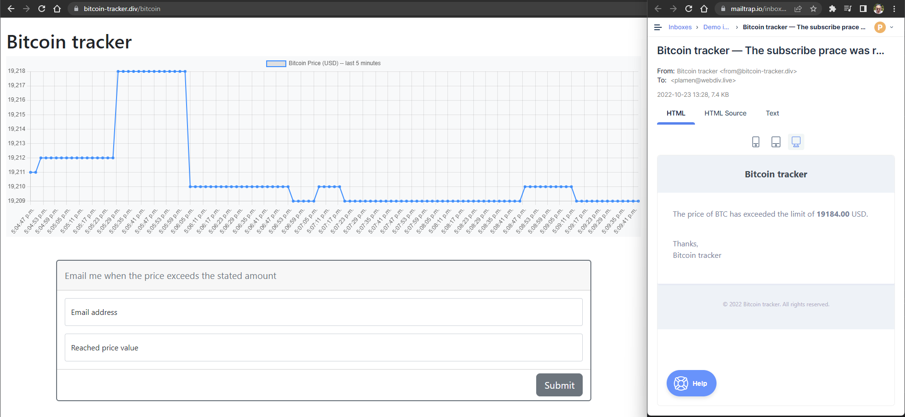
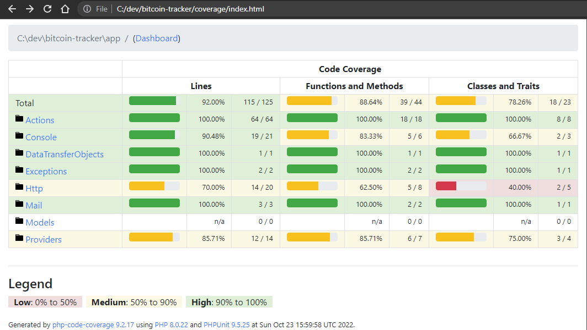

# Bitcoin tracker &mdash; ~~Full  Stack~~ PHP [Dev task](https://docs.google.com/document/d/1lvhHeItZH1Y2PWA9ZLkQcbkIQ33tWHlnmuUOC4NG_z4/edit?usp=sharing)

Site that has a single page showing chart with Bitcoin price in USD. Data come collected by the [Bitfinex API](https://docs.bitfinex.com/v1/reference#rest-public-ticker). On the page exists simple webform allowing the visitor to register for mail notification at given price value. The systems sends notification every time the price reaches the value.



## Description

*As agreed the View.js or React - FE part of the task was omitted.*

The shown on the page chart come loaded directly by the controller, then uses JavaScript `setInterval` function to update the chart content on every 2500ms.

The data feeding API, adds restriction of maximum 30 calls per minute. The site was build to pull data from it on every 2.5 seconds, which ensures the Api call will not become restricted. The site snapshots interval can be controlled by the dedicated var from the `.env` file.

The built in Laravel native scheduler (`artisan schedule:run`) has restriction of call per minute, so here was used the [spatie/laravel-short-schedule](https://github.com/spatie/laravel-short-schedule) package which allows the data feeding command (`get:snapshot-from-bitfinex-pubticker`) to be called on the needed interval of 2.5sec.

The last stated above command writes the new snapshot to the database, then checks does the newly added price exceeds the previously added price. In case it does, the command adds a new command (`notify:relevant-price-reach-subscribers`) call to the queue, passing both the last and current prices as parameters.

When the 'notify' command come executed it checks does exists any subscriber who's price value comes between both passed prices. If found such subscriber/s, the system sends email to the subscriber's mailbox an message that the stated by him price been reached. Before the message come submitted come executed additional check to the system cache, ensuring there no message sent to the same subscriber in the last hour.

### *In case of* External Api failure

While the site is active, any disruption in the API processing generates error log added to the system's log on every 2.5sec execution. When the API restores own work the normal processing continues.

`storage/logs/laravel.log`:

```
...
[2022-10-25 05:29:38] local.INFO: Ticked: `get:snapshot-from-bitfinex-pubticker` (#32867, USD19323)  
[2022-10-25 05:29:41] local.ERROR: cURL error 6: Could not resolve host: api.bitfinex.com (see https://curl.haxx.se/libcurl/c/libcurl-errors.html) for https://api.bitfinex.com/v1/pubticker/BTCUSD
{"exception":"[object] (GuzzleHttp\\Exception\\ConnectException(code: 0): cURL error 6: Could not resolve host: api.bitfinex.com
(see https://curl.haxx.se/libcurl/c/libcurl-errors.html) for https://api.bitfinex.com/v1/pubticker/BTCUSD at C:\\dev\\bitcoin-tracker\\vendor\\guzzlehttp\\guzzle\\src\\Handler\\CurlFactory.php:210)
...
```


### *In case of* Current server failure

In case of the current server outage, the system will stop the data feeding and notifications. After the server restoration it will continue from the last recorded snapshot value, sending notification only to the short list of the subscribers which price value will become within the last recorded before the failure price and the new one taken after the server reboot.

In case of such outage the site cache will be lost. Solution here can be external cache usage and/or the additional storage of the notified subscribers ids within every 'price-increase' shapshot record. 

## Installation

```bash
composer require pimarinov/bitcoin-tracker
```

*PHP 8 was used in development &mdash; max allowed version by [Laravel Framework 7.30.6](https://laravel.com/docs/master/releases#support-policy)*

## Setup

To allow the site data feeding and the visitor subscription processing, run via Cli both shown below commands:

1. Allow Bitcoin data to be load by the external Api:

   ```bash
   php artisan short-schedule:run
   ```

2. Queue &mdash; for the subscribers sendmail jobs to be processed:

   ```bash
   php artisan queue:listen
   ```

The system uses config vars (see `.env.example`):

- **`SNAPSHOT_TAKE_INTERVAL_SECONDS`** - allows change of the snapshot take-interval. 
    *2.5 sec sec follows the API throttling, at shortest possible pull-data rate.*
    
    ```php
    SNAPSHOT_TAKE_INTERVAL_SECONDS=2.5
    ```


-  **`SUBSCRIBER_SILENCE_SECONDS`** - which allows the visitor notifications to be stopped for given time period. This prevents unacceptable count of mail submission for the case of near price fluctuations.

    ```php
    SILENCE_SECONDS_FOR_NOTIFIED_SUBSCRIBER=3600
    ```

## CLI

Available commands:

```bash
php artisan get:snapshot-from-bitfinex-pubticker
```

```bash
php artisan notify:relevant-price-reach-subscribers 120 236.50
```

The last command uses 2 price parameters `{last}` & `{current}`, call signatutre is: `notify:relevant-price-reach-subscribers {lastPriceValue} {currentPriceValue}`. It has built-in internal validation for: `$current > $last`&mdash; as the subscribers should be notified only on the price increase.

## Testing

```bash
php artisan test --coverage-html coverage --coverage-clover coverage
```

   **Note** Tests aims higher level of coverage, omitting the test doubles.

### Tests coverage

Check the **coverage** folder after the test been executed. To load coverage report within the CLI, use: 

```bash
vendor/bin/phpunit --coverage-html
```



## License

The MIT License (MIT). Please see [License File](LICENSE.md) for more information. Project icon credits: <a href="https://www.freepik.com/free-vector/bitcoin-growth-green-chart-background_25022313.htm#page=3&query=bitcoin%20chart&position=0&from_view=keyword">Image by starline</a> on Freepik

